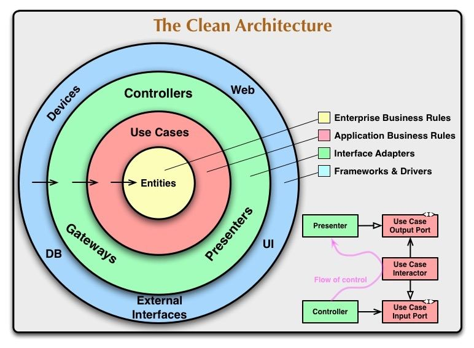
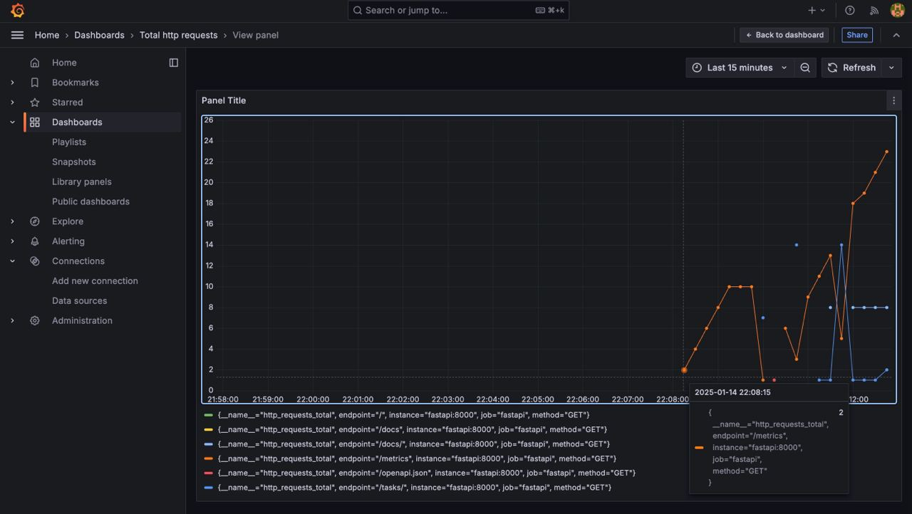

# Введение
Проект назначен для ведения портала самоподготовки к экзаменам.

# Проект
## Технологический стек
- **Python**: `3.12`
- **Production**: `alembic`, `dishka`, `fastapi`, `asyncpg`, `sqlalchemy[async]`, `gunicorn`, `minio`, `prometheus`, `grafana`
- **Development**: `isort`, `ruff`, `pre-commit`
## API
<p align="center">
  
  <br><em>Handlers</em>
</p>

### General
- '/': Открыт для **всех**
   - Перенаправляет на Swagger документацию

### Tasks (`/tasks`)

- '/' (GET): Открыт для **всех**
  - Отдает информацию о задании, ссылки на файлы к заданию
- '/' (POST): Открыт для **всех**
  - Создает задание, ожидая информацию о задании и файлы

### Metrics (`/metrics`)
Обязательный handler для prometheus
 - Стандарт Prometheus: Все приложения, интегрирующиеся с Prometheus, экспонируют метрики через специальный эндпоинт
 - Автоматическое поведение Prometheus: При сборе данных Prometheus отправляет запросы типа GET /metrics к каждому указанному таргету
## Файловая структура
```
.
├── conf # Конфиги
│  
├── docs
└── src
    ├── exam_tutor
    │   │
    │   ├── application/... # Логика приложения, порты
    │   │  
    │   │  
    │   ├── controllers/... # Внешнее общение
    │   │  
    │   │  
    │   ├── domain/... # Доменная модель
    │   │  
    │   │  
    │   ├── entrypoint/... # Конфигурирование и IoC
    │   │  
    │   │  
    │   └── infrastructure/... # Адаптеры
    │  

```

## Описание схем реляционной базы данных
Использован императивный подход. С помощью `map_imperatively` была смаплена доменная модель в представление базы данных.

## Зависимости
Приложение разделено на слои:
1. Domain
2. Application
3. Infrastructure
4. Presentation

<p align="center">
  
  <br><em>Чистая архитектура, Роберт Мартин</em>
</p>

- Соблюден принцип инверсии зависимотей
- Зависимости доставляются при помощи инъекции зависимостей, используя di-framework Dishka
## Метрики
### Сбор метрик
Использован Prometheus для сбора метрик приложения, а также написан middleware для подсчета вызовов каждого endpoint.
### Визуализация метрик
Испольована Grafana, создано подключение к prometheus и создан dashboard.
<p align="center">
  
  <br><em>Visualization</em>
</p>


#### License

This project is licensed under the MIT License - see the [LICENSE](./LICENSE) file for details.
